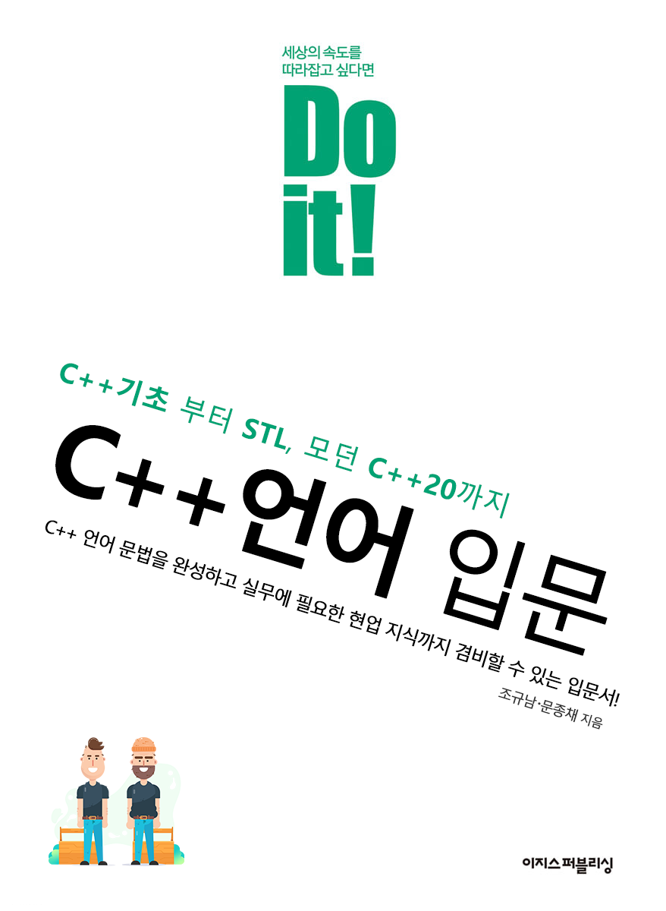

# DoItCPP

이 Git Repository는 이지스퍼블리싱의 __Do It!__ 시리즈인 __Do It! C++입문__ 서적의 Source Code 파일 및 정오표등을 제공하기 위한 Repository 입니다.

</img>
- [Coding Convention (소스 코드 작성 규칙)](CodingConvention.md)

## 소스코드
### 첫째마당 초급편
#### 01장 C++ 시작하기
- C++언어의 범용성
#### 02장 C++ 프로그래밍 시작하기
#### 03장 예외처리 및 디버깅
#### 04장 객체지향 프로그래밍
### 둘째마당 중급편
#### 05장 템플릿
#### 06장 객체지향 자세히 알아 보기
#### 07장 STL(표준 템플릿 라이브러리)
### 세째마당 고급편
#### 08장 모던 C++
#### 09장 멀티쓰레드, Concurrent 프로그래밍
### 네째마당 활용편
#### 10장 C++ 실무 활용 하기
#### 11장 C++개발자로써 알아야 할 것들