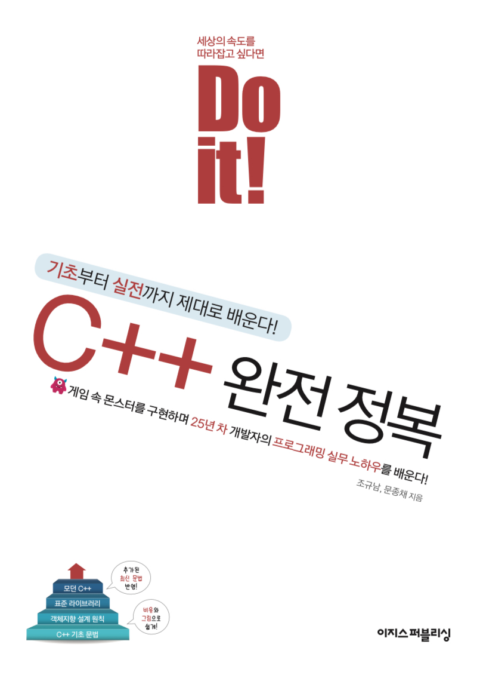

# Do It! C++ 완전 정복

이 Git Repository는 이지스퍼블리싱의 __Do It!__ 시리즈인 __Do It! C++ 완전 정복__ 서적의 Source Code 파일 및 정오표등을 제공하기 위한 Repository 입니다. 
* 본문/예제/되새김문제 관련 질문이나 오류 사항은 [이슈 게시판](https://github.com/mystous/DoItCPP/issues)에 올려 주세요. 본문/예제/되새김문제와 관련이 적은 개인/회사 과제 해결에 대해서는 답변이 늦거나 못 드릴 수 있음을 양해 부탁 드립니다.

</img>
- [Coding Convention (소스 코드 작성 규칙)](CodingConvention.md)

### [예제 소스코드](https://github.com/mystous/DoItCPP/tree/master/sample_code)
### [정오표](https://github.com/mystous/DoItCPP/blob/master/erratum/erratum.csv)
## 목차
### 첫째마당 C++ 프로그래밍 기초
#### 01장 C++ 프로그래밍 시작하기
#### 02장 변수와 연산자
#### 03장 포인터와 메모리 구조
#### 04장 실행 흐름 제어
#### 05장 예외 처리하기
### 둘째마당 객체지향 프로그래밍
#### 06장 객체지향과 클래스
#### 07장 객체지향 프로그래밍 특징
#### 08장 객체지향을 돕는 기능들
#### 09장 객체지향 설계 원칙
#### 10장 템플릿
### 셋째마당 라이브러리 활용
#### 11장 C++ 표준 라이브러리
#### 12장 STL의 컨테이너와 알고리즘
### 넷째마당 모던 C++ 프로그래밍
#### 13장 모던 C++에 추가된 기능
#### 14 새로운 데이터 형식과 라이브러리
#### 15 새로운 구문 1
#### 16 새로운 구문 2
