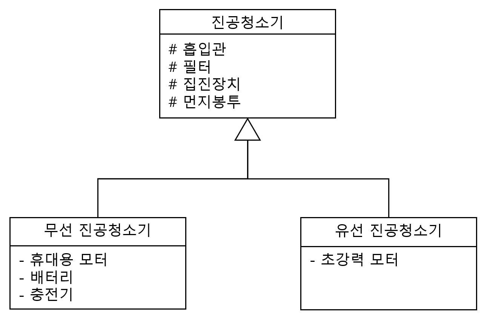

#### 문제 2 객체 관계 ‘is-a’, ‘has-a’
객체 간에 ‘is-a’, ‘has-a’ 관계를 잘 생각하면서 진공 청소기의 부품과 다양한 진공 청소기(무선, 유선 등)를 설계해서 클래스 다이어그램으로 표현해 보세요.  

---

#### 모범 답안 과 설명
##### 답안

##### 설명
무선 진공청소기, 유선 진공 청소기 모두 진공청소기를 상속 받았습니다. 무선 진공 청소기는 진공 청소기와 'is-a' 관계이고 유선 진공 청소기 역시 진공 청소기와 'is-a' 관계입니다. 그리고 멤버 변수로 들어가 있는 흡입관, 필터, 집진장치, 먼지 봉투는 진공 청소기가 'has-a' 관계를 맺고 있습니다. 무선 진공청소기는 휴대용 모터, 배터리, 충전기와 'has-a' 관계를 맺고 있으며, 유선 진공 청소기는 초강력 모터와 'has-a' 관계입니다.
* 클래스 다이어 그램의 모양은 다양할 수 있습니다. 무선, 유선 청소기가 진공 청소기를 상속 받아 'is-a' 관계를 가지고 있고, 각 청소기가 부품을 'has-a' 관계로 포함하면 됩니다.
* 9장에서 배울 내용을 미리 소개 하자면, 휴대용 모터와 초강력 모터 역시 인터페이스 모터에서 상속을 받고 모든 청소기는 인터페이스 모터를 포함(has-a)하고 각 청소기에 맞는 모터 객체가 인터페이스 모터의 is-a로 포함되면 됩니다. 이 부분은 모범 답안에서는 생략하였습니다.
  
[문제로 돌아 가기](README.md "문제로 돌아 가기")
