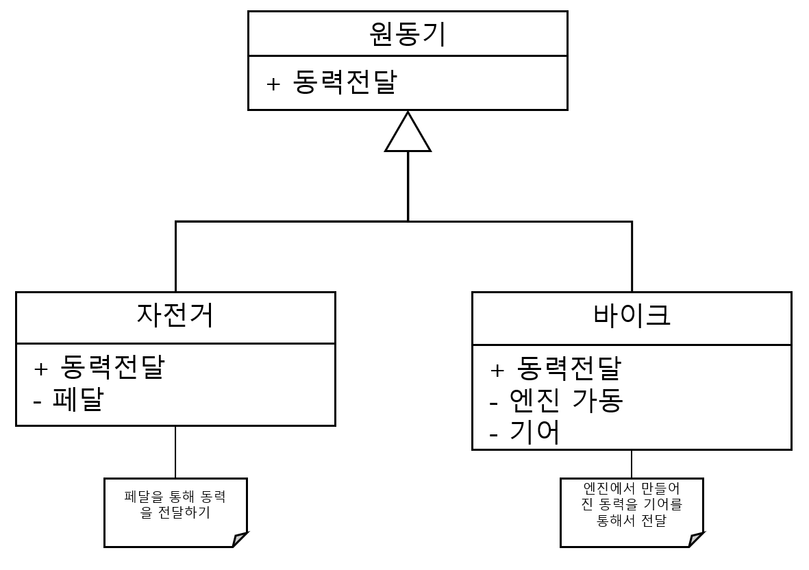

#### 문제 3 다형성 이해하기
다형성을 적용할 수 있는 클래스 예를 3개 만들고 어떤 기능에 다형성을 적용할지 정해 보세요.
  

---

#### 모범 답안
##### [답안]
__1. 커피머신__

__2. 베이킹__

__3. 원동기__

##### 설명
1. 커피 머신은 에스프레소 머신과 브루잉 머신 두개의 클래스가 커피 추출 함수에 대해 다형성을 구현하였습니다. 각각 고압으로 에스프레소 원액을 추출하거나 거름종이로 커피를 내립니다.
2. 베이킹은 카스테라와 단팥빵 기계 두개의 클래스가 베이킹 함수를 다형성으로 구현했습니다. 카스테라는 반죽을 굽기만 하면 되지만 단팥빵은 팥소를 만들는 과정과 객체가 추가되어 있습니다.
3. 원동기는 자전거와 바이크(오토바이) 클래스가 있으며 동력 전달을 다형성으로 구현하였습니다. 자전거는 페달을 통해서 동력을 전달하고 바이크는 엔진으로 만들어진 힘을 기어로 전달 합니다.

* 현실에 대한 가상의 모델링 이기 때문에 다양한 예시를 만들 수 있습니다

[문제로 돌아 가기](README.md "문제로 돌아 가기")
