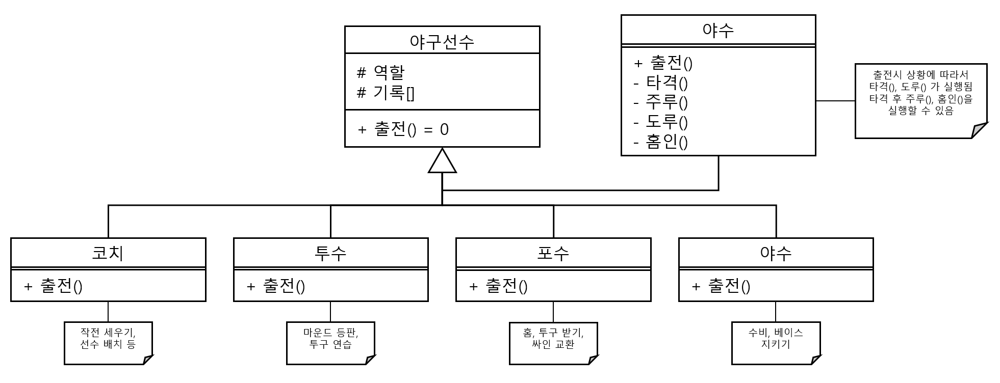

#### 문제 2 객체지향 설계 #1
객체지향 프로그래밍의 4가지 특징을 활용해 야구팀의 선수와 코치를 설계하고 설계된 내용을 클래스 다이어그램으로 그려 보세요.
  

---

#### 모범 답안 과 설명
##### 답안

##### 설명
코치와 선수는 모두 야구선수 입니다. 가장 기본이 되는 클래스는 야구선수 입니다. 출전()이라는 함수는 순수 가상 함수로 만들어서 상속 받은 모든 클래스가 구현하도록 했습니다.

야구 선수를 상속 받은 코치, 투수, 포수 등 모든 클래스는 출전() 함수를 다형성으로 다르게 구현합니다. 

야수의 경우 출전()이라는 함수 속에 타격, 도루, 주루, 홈인등 다양한 함수를 내부에서 호출하는 캡슐화를 구현하였습니다.

[문제로 돌아 가기](README.md "문제로 돌아 가기")
