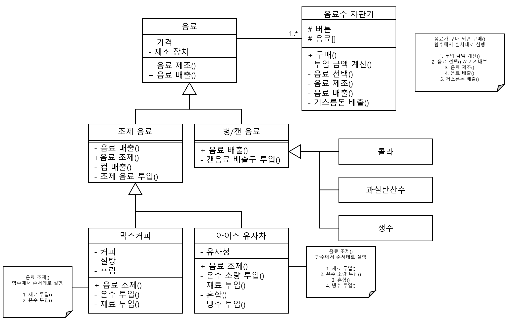

#### 문제 3 객체지향 설계 #2
객체지향 프로그래밍의 4가지 특징을 활용해 음료수 자판기를 설계하고 설계된 내용을 클래스 다이어그램으로 그려 보세요.
  

---

#### 모범 답안
##### 답안

##### 설명
조금 복잡한 다이어그램입니다. 음료수 자판기는 멤버 변수와 멤버 함수가 꽤 많습니다. 음료수 자판기는 음료를 구매 하면 순차적으로 외부에 노출되지 않은 일련의 순서로 함수를 호출 합니다. (캡슐화)

자판기에서 판매되는 음료는 제품 자체를 그대로 판매하는 병/캔 음료와 조제가 필요한 음료로 나뉩니다. 음료 클래스에서 상속 받은 두 클래스는 음료 조체와 배출이 다형성을 통해서 다르게 구현됩니다.

조제 음료는 다시 믹스 커피(따뜻한 음료)와 아이스 유자차(시원한 음료)로 나뉘고 두 클래스의 임료 조제는 다형성으로 다르게 구현되어 있습니다. 음료 조제는 일련의 함수로 캡슐화 되어 있습니다.

[문제로 돌아 가기](README.md "문제로 돌아 가기")
