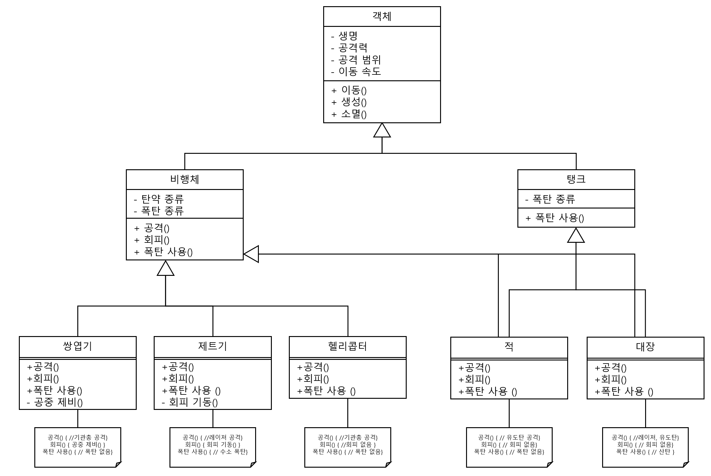

#### 문제 4 객체지향 설계 #3
객체지향 프로그래밍의 4가지 특징을 활용해 슈팅 게임을 설계하고 설계된 내용을 클래스 다이어그램으로 그려 보세요.
  

---

#### 모범 답안
##### 답안

##### 설명
슈팅 게임에 나오는 모든 객체의 특징을 추상화한 객체 클래스로 부터 모든 클래스들이 상속 받습니다. 이 클래스를 상속 받은 비행체와 탱크 두 종류가 있습니다. 각각 공격과 회피를 위한 함수들이 있고, 이 두 클래스를 상속 받은 클래스들이 다형성으로 공격(), 회피(), 폭탄 사용()을 정의 합니다.

[문제로 돌아 가기](README.md "문제로 돌아 가기")
