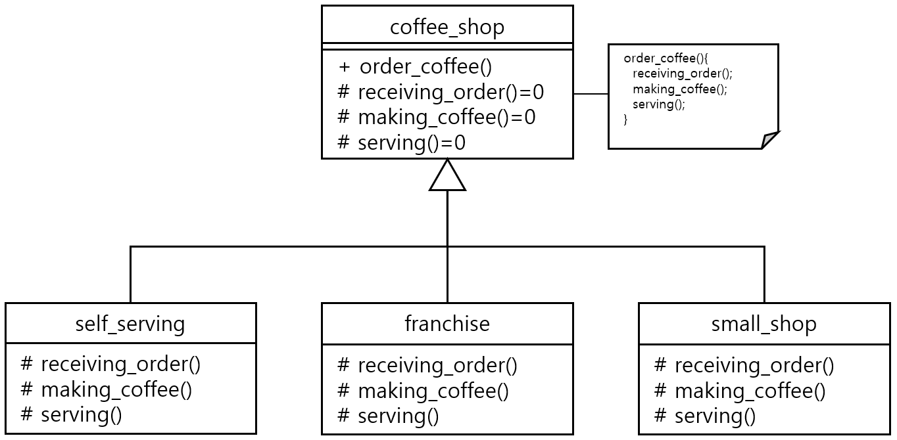

#### 문제 3 가상 함수 활용
커피를 제공하는 클래스를 만들어 보세요. 커피를 제공하는 기본 흐름은 order_coffee 멤버 함수로 구현합니다. order_coffee 함수는 커피 주문받기, 커피 만들기, 커피 서빙하기를 수행합니다. 그리고 이 클래스를 상속받는 다양한 커피 판매소가 있습니다. 커피 판매소1은 무인 매장이고 판매소2는 프랜차이즈, 판매소3은 주문만 키오스크를 사용합니다. 커피 판매소1~3은 모두 커피를 만드는 클래스를 상속받습니다. 이 조건에 만족하는 클래스를 설계하고 의사코드를 작성해 보세요.
<br/><br/>

---


#### 모범 답안
##### 답안

```cpp
```

실행결과
```
```
##### 설명
coffee_shop 클래스는 커피를 주문하는 절차를 템플릿으로 가지고 있는 추상 클래스 입니다. order_coffee() 정의에서 주문 절차에 해당하는 함수들을 정해진 순서로 호출합니다. 하지만 coffee_shop 클래스에서 receiving_order(), making_coffee(), serving() 함수를 구현하지 않고 순수 가상함수로만 정의했습니다. order_coffee() 함수에서는 순수가상 함수를 정해진 절차에 맞게 호출 하기만 합니다.

self_serving, franchise, small_shop은 모두coffee_shop을 상속 받은 클래스 입니다. 3클래스 모두 receiving_order(), making_coffee(), serving()를 자신의 특성에 맞게 정의 합니다. order_coffee()는 부모 클래스의 함수를 그대로 사용하여 부모 클래스의 의도한 흐름을 따릅니다.

실행 결과는 각 클래스에서 재정의한 함수들이 호출됩니다.

[문제로 돌아 가기](README.md "문제로 돌아 가기")
