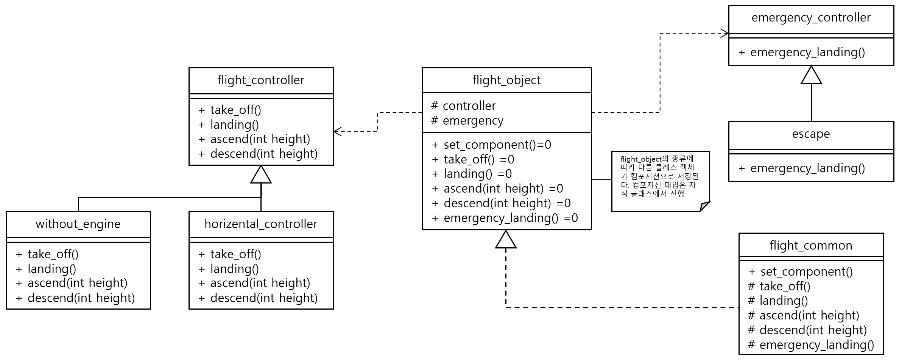

#### 문제 4 C++ 추상 클래스 활용
추상 클래스를 활용해 비행기 클래스를 설계해 보세요. 비행기는 전투기, 대형 항공기, 헬리콥터, 행글라이더 4종류입니다. 필수 기능으로는 이륙, 착륙, 고도 상승, 고도 하강, 불시착입니다. 추상 클래스를 여러 개 활용해도 됩니다. 공통 기능은 상속이 아닌 컴포지션이나 어그리게이션으로 작성해 보세요.
<br/><br/>

---


#### 모범 답안

##### 답안
```cpp
#include <iostream>
#include <vector>

using namespace std;

const int diff_height = 10;

class flight_controller {
public:
  virtual int take_off();
  virtual int landing();
  virtual int ascend(int height, int delta);
  virtual int descend(int height, int delta);
};

int flight_controller::take_off() {
  cout << "이륙" << endl;
  return 100;
}

int flight_controller::landing() {
  cout << "착륙" << endl;
  return 0;
}

int flight_controller::ascend(int height, int delta) {
  cout << "꼬리 날개 작동: 고도 상승 (" << height << " -> " << height + delta << ")" << endl;
  return height + delta;
}

int flight_controller::descend(int height, int delta){
  int new_height = (height - delta) > 0 ? (height - delta) : 0;
  cout << "꼬리 날개 작동: 고도 하강 (" << height << " -> " << new_height << ")" << endl;
  return new_height;
}

class horizental_controller : public flight_controller {
public:
  virtual int ascend(int height, int delta) override;
  virtual int descend(int height, int delta) override;
};

int horizental_controller::ascend(int height, int delta) {
  cout << "양력 추가: 고도 상승 (" << height << " -> " << height + delta << ")" << endl;
  return height + delta;
}

int horizental_controller::descend(int height, int delta) {
  int new_height = (height - delta) > 0 ? (height - delta) : 0;
  cout << "양력 감소: 고도 하강 (" << height << " -> " << new_height << ")" << endl;
  return new_height;
}

class without_engine : public flight_controller {
public:
  virtual int take_off() override;
  virtual int ascend(int height, int delta) override;
  virtual int descend(int height, int delta) override;
};


int without_engine::take_off() {
  cout << "높은 곳에서 출발" << endl;
  return 150;
}

int without_engine::ascend(int height, int delta) {
  cout << "바람타고 상승 " << height << " -> " << height + delta << ")" << endl;
    return height + delta;
}

int without_engine::descend(int height, int delta) {
  int new_height = (height - delta) > 0 ? (height - delta) : 0;
  cout << "동체 하강 (" << height << " -> " << new_height << ")" << endl;
  return new_height;
}


class emergency_controller {
public:
  virtual void emergency_landing();
};

void emergency_controller::emergency_landing() {
  cout << "동체 착륙" << endl;
}

class escape : public emergency_controller {
public:
  virtual void emergency_landing() override;
};


void escape::emergency_landing() {
  cout << "비상 탈출" << endl;
}

class flight_object {
public:
  virtual void set_component(flight_controller *controller_param, emergency_controller* emergency_param) = 0;
  virtual void take_off() = 0;
  virtual void landing() = 0;
  virtual int ascend(int height) = 0;
  virtual int descend(int height) = 0;
  virtual void emergency_landing() = 0;

protected:
  flight_controller* controller = nullptr;
  emergency_controller* emergency = nullptr;
  int flight_height = 0;
};

class flight_common : public flight_object{
public:
  flight_common(string flight_name, flight_controller* controller_param, emergency_controller* emergency_param) 
  : object_name(flight_name){
    set_component(controller_param, emergency_param);
  };
  string get_object_name() { return object_name; };
  int get_height() { return flight_height; };
  virtual void set_component(flight_controller* controller_param, emergency_controller* emergency_param) override;
  virtual void take_off() override;
  virtual void landing() override;
  virtual int ascend(int height) override;
  virtual int descend(int height) override;
  virtual void emergency_landing() override;
private:
  string object_name;
};

void flight_common::set_component(flight_controller* controller_param, emergency_controller* emergency_param) {
  controller = controller_param;
  emergency = emergency_param;
}

void flight_common::take_off() {
  if (nullptr == controller) {
    return;
  }
  flight_height = controller->take_off();
}

void flight_common::landing() {
  if (nullptr == controller) {
    return;
  }
  flight_height = controller->landing();
}

int flight_common::ascend(int height) {
  if (nullptr == controller) {
    return -1;
  }
  flight_height = controller->ascend(flight_height, height);
}

int flight_common::descend(int height) {
  if (nullptr == controller) {
    return -1;
  }
  flight_height = controller->descend(flight_height, height);
}

void flight_common::emergency_landing() {
  if (nullptr == emergency) {
    return;
  }
  emergency->emergency_landing();
  flight_height = 0;
}

int main()
{
  flight_controller aircraft_controlller;
  horizental_controller helicopter_controller;
  without_engine glider_controller;

  emergency_controller emergency_device;
  escape emergency_exit;

  vector<flight_common*> flight_set;

  flight_common fighter("전투기", &aircraft_controlller, &emergency_device);
  flight_set.push_back(&fighter);

  flight_common huge_aircraft("대형 항공기", &aircraft_controlller, &emergency_device);
  flight_set.push_back(&huge_aircraft);

  flight_common helicopter("헬리콥터", &helicopter_controller, &emergency_exit);
  flight_set.push_back(&helicopter);

  flight_common hang_glider("행글라이더", &glider_controller, &emergency_exit);
  flight_set.push_back(&hang_glider);

  for (auto&& flight : flight_set) {
    cout << endl << flight->get_object_name() << "의 비행이 시작됩니다." << endl;
    cout << "이륙" << endl;
    flight->take_off();
    cout << "고도(" << flight->get_height() << ")" << endl;
    flight->ascend(30);
    cout << "고도(" << flight->get_height() << ")" << endl;
    flight->descend(10);
    cout << "고도(" << flight->get_height() << ")" << endl;
    flight->landing();
    cout << "고도(" << flight->get_height() << ")" << endl;
  }

  for (auto&& flight : flight_set) {
    cout << endl << flight->get_object_name() << "의 비행이 시작됩니다." << endl;
    cout << "이륙" << endl;
    flight->emergency_landing();
  }
  return 0;
}

```
실행결과
```
전투기의 비행이 시작됩니다.
이륙
이륙
고도(100)
꼬리 날개 작동: 고도 상승 (100 -> 130)
고도(130)
꼬리 날개 작동: 고도 하강 (130 -> 120)
고도(120)
착륙
고도(0)

대형 항공기의 비행이 시작됩니다.
이륙
이륙
고도(100)
꼬리 날개 작동: 고도 상승 (100 -> 130)
고도(130)
꼬리 날개 작동: 고도 하강 (130 -> 120)
고도(120)
착륙
고도(0)

헬리콥터의 비행이 시작됩니다.
이륙
이륙
고도(100)
양력 추가: 고도 상승 (100 -> 130)
고도(130)
양력 감소: 고도 하강 (130 -> 120)
고도(120)
착륙
고도(0)

행글라이더의 비행이 시작됩니다.
이륙
높은 곳에서 출발
고도(150)
바람타고 상승 150 -> 180)
고도(180)
동체 하강 (180 -> 170)
고도(170)
착륙
고도(0)

전투기의 비행이 시작됩니다.
이륙
동체 착륙

대형 항공기의 비행이 시작됩니다.
이륙
동체 착륙

헬리콥터의 비행이 시작됩니다.
이륙
비상 탈출

행글라이더의 비행이 시작됩니다.
이륙
비상 탈출
```
##### 설명
이번 되새김 문제의 풀이는 조금 다른 형태로 만들어봤습니다. 모든 비행체의 특성과 행동을 flight_object 추상 클래스로 정의하고 이를 상속 받은 flight_common으로 4종류의 비행기를 인스턴스로 생성합니다.

동일한 클래스를 상속받은 인스턴스이지만 비행체를 조정하는 컨트롤러를 컴포지션으로 다르게 가지기 때문에 실제 동작은 각 비행체의 특성에 맞게 조절됩니다.

전투기와 대형 항공기는 동일한 비행장치와 비상 조절 장치를 사용하기 때문에 완전히 동일한 동작을합니다. 하지만 헬리콥터와 행글라이더는 각각의 비행장치에 맞는 동작을 합니다. 비상 조절 장치는 헬리콥터와 행글라이더가 같은 비상 조절 장치를 사용하기 때문에 동일한 비상 탈출 동작을 합니다.

이번 답안은 추상 클래스를 상속 받아 기능을 계층으로 확대 하는 것과 어그리게이션을 통해서 논리적으로 기능을 쪼개어 확장할 수 있는 방법을 제시 하였습니다. 이런 패턴을 사용하면 flight_object나 flight_common을 수정하지 않아도 다양한 비행체를 구현할 수 있으며, 두 클래스가 라이브러리로 제공딘다고 하더라도 확장에 전혀 어려움이 없습니다. 수정에 닫혀 있고 확장에 열려 있게 되는 것이죠.

* 4가지 비행체를 flight_object에서 상속받아서 각각 구현하여도 무방합니다. 또는 flight_common을 상속받아서 구현하여도 됩니다.


[문제로 돌아 가기](README.md "문제로 돌아 가기")
