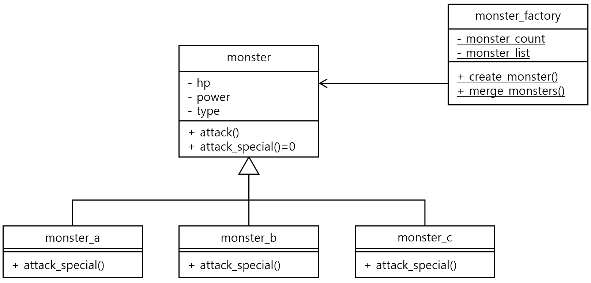

#### 문제 5 정적 멤버 활용
정적 멤버의 특징을 활용해 자유로운 주제로 클래스를 설계하고 구현해 보세요. 설계는 클래스 다이어그램을 활용합니다.
<br/><br/>

---


#### 모범 답안
##### 답안

##### 설명
정적 멤버 변수와 함수를 가장 잘 활용하는 디자인 패터이 있습니다. 바로 팩토리 패턴입니다. 팩토리 패턴은 객체를 생성하는 클래스를 별도로 두고 해당 클래스가 객체를 만들어 내는 형태입니다. 공장에서 물건을 만드는 것 같다고 해서 팩토리(Factory) 패턴이라고 불립니다.

monster_a, monster_b, monster_c는 monster를 상속 받았고, 몬스터 팩토리에서 몬스터를 만들고, 합합니다. 만들어진 몬스터는 리스트에 저장이 되고 몇개가 만들어졌는지 정적 멤버 변수에 저정합니다. 몬스터 팩토리는 멤버 함수 및 멤버 변수 모두 정적 함수, 정적 변수로 만들어졌습니다.

UML에서 정적 멤버는 밑줄을 그어서 표시 합니다. 정적 멤버로만 구성된 클래스는 객체를 따로 만들 필요 없이 클래스 이름과 범위 연산자로 함수를 호출합니다. 아래는 사용범에 대한 예시입니다. 생략된 코드가 많습니다. 정적 함수 사용법만 확인해주세요.
```cpp
monster_a *mon = monster_factory::create_monster(/***/); // type a로 생성 - Type enum은 예제에서 생략했습니다.
monster_b *mon_scrafy = monster_factory::create_monster(/***/); // type b로 생성

mon = monster_factory::merge_monster(mon, mon_scrafy);
```

[문제로 돌아 가기](README.md "문제로 돌아 가기")
