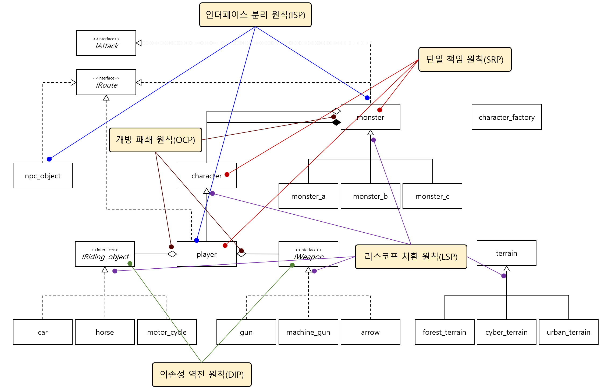
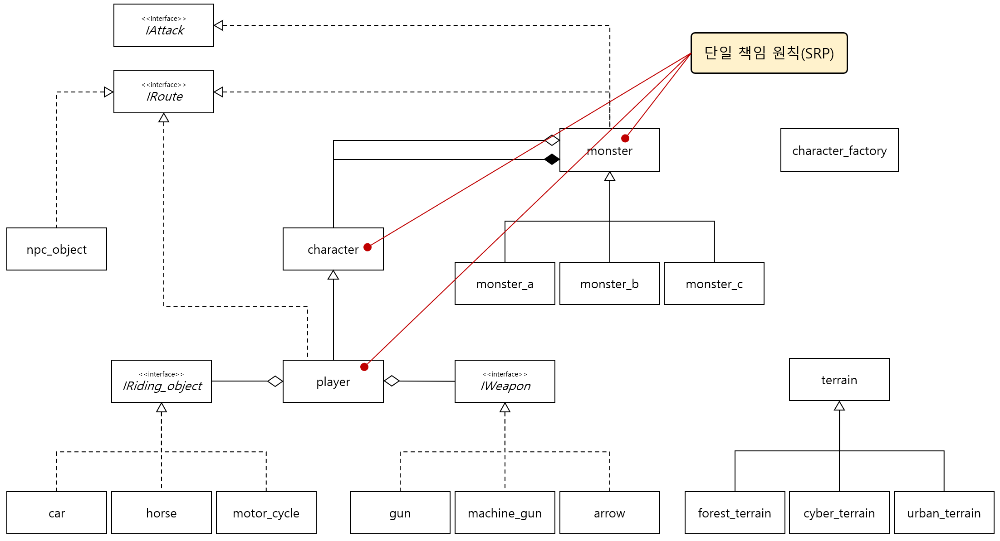
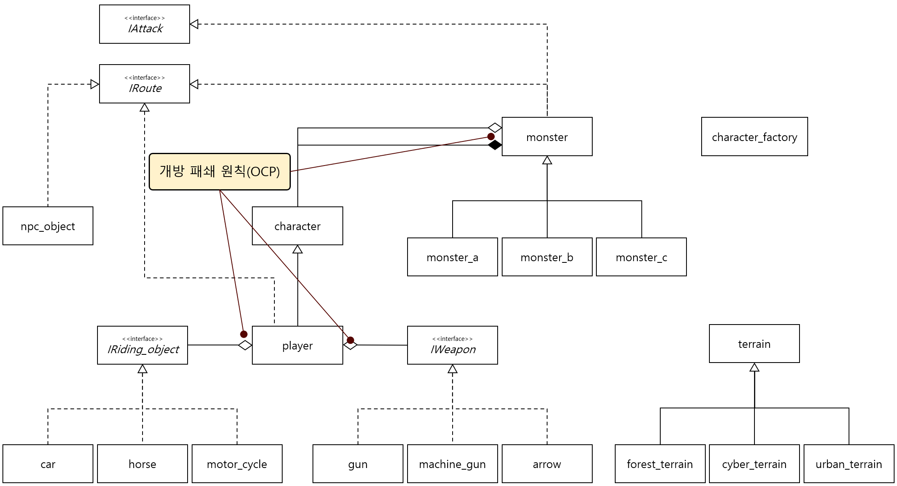
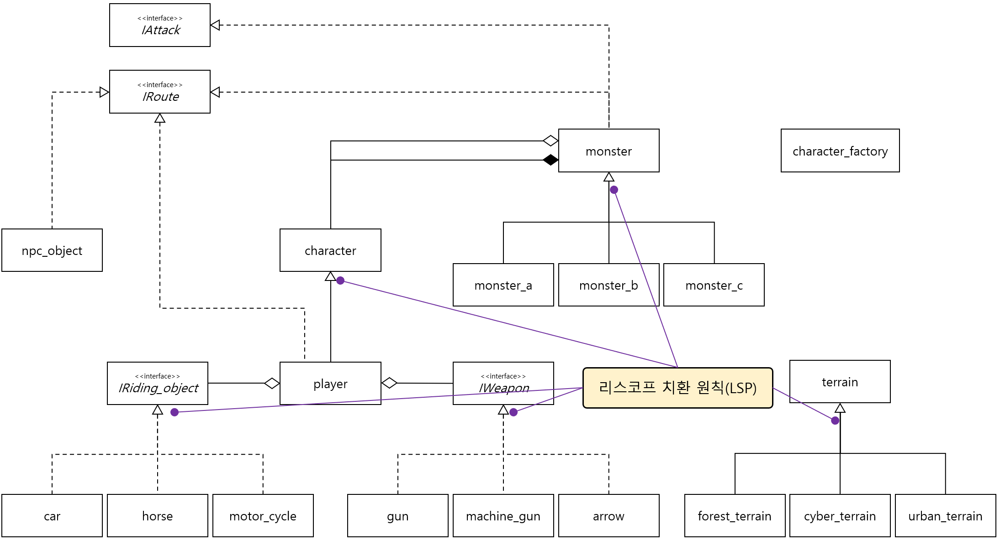
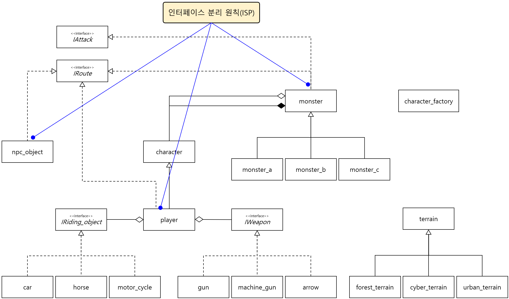
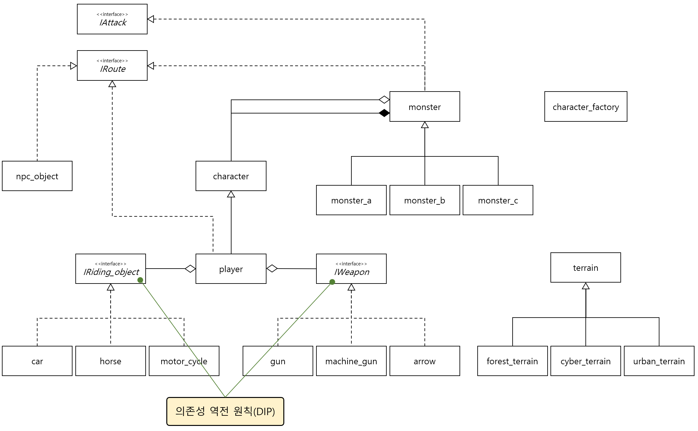

#### 문제 5 SOLID 원칙 고민해 보기
의존성 역전 원칙에서 보인 코드에는 SOLID의 여러 가지 원칙이 적용돼 있습니다. 해당 코드에 적용된 SOLID 원칙을 찾아서 어떻게 적용되어 있는지 설명해 보세요.
  

---

#### 모범 답안
##### 답안

DIP 예제의 클래스 다이어 그램에 SOLID 원칙을 모두 한 번에 표시해 보았습니다. 너무 복잡해서 내용을 알아 볼 수 없을 정도네요. 이제 SOLID 원칙을 하나씩 살펴 보겠습니다.

###### SRP

player, character, monster는 각각 다른 성격의 객체를 추상화한 클래스 입니다. 각 역할은 분리되어 있고, 수정이 필요할 경우 별도로 수정이 됩니다.

###### OCP

character는 monster 클래스에 어그리게이션과 컴포지션으로 포함되어 있고, player는 탈것과 무기를 어그리게이션으로 포함하고 있습니다.

###### LSP

monster를 상속받은 monster_a~c클래스, terrain을 상속받은 각종 지형들은 부모 클래스를 완벽히 대체 할 수 있는 'is-a' 관계입니다.

###### ISP

IAttack과 IRoute는 공격과 이동에 대한 인터페이스로 움직이고 공격하는 객체들이 의존하는 인터페이스입니다. 이 둘은 분리하여 작은 단위로 역할을 분리하였고 monster, player, npc_object는 각각 필요한 인터페이스에만 의존하는 것을 확인할 수 있습니다.

###### DIP

player는 무기와 탈것을 직접 포함하지 않고 무기와 탈것을 추상화한 상위 인터페이스에만 의존하고 있습니다.

[문제로 돌아 가기](README.md "문제로 돌아 가기")
