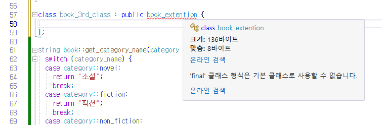

#### 문제 5 도서 클래스 확장
앞선 문제에서 만든 도서 클래스를 동료와 함께 협업하기로 했습니다. 동료는 도서 클래스를 상속받아서 개발합니다. 그리고 클래스가 더 이상 상속되지 않도록 막으려고 합니다. 또한 도서 클래스의 멤버 변수를 생성자에서 지정할 수 있게 추가하면서 기본 생성자도 사용하고 싶습니다. 기본 생성자를 사용할 때 멤버 변수 초기화가 되었으면 합니다. 이 외에도 상속 과정에서 발생할 수 있는 여러분의 요구 사항을 추가하여 도서 클래스를 확장해 보세요.
<br/><br/>

---


#### 모범 답안
##### 답안
```cpp
#include <iostream>
#include <vector>
#include <compare>
#include <algorithm>
using namespace std;

weak_ordering get_ordering_result(strong_ordering compare_result) {
  if (compare_result < 0) {
    return weak_ordering::less;
  }

  if (compare_result > 0) {
    return weak_ordering::greater;
  }

  return weak_ordering::equivalent;
}

class book {
public:
  enum class category { novel, fiction, non_fiction, sf, essay };
  book() = default;
  book(string title_param, string author_param, unsigned int publish_year_param,
    unsigned int price_param, string isbn_param, unsigned int lent_count_param, category book_category_param)
    : title(title_param), author(author_param), publish_year(publish_year_param),
    price(price_param), isbn(isbn_param), lent_count(lent_count_param), book_category(book_category_param) {};
  weak_ordering operator<=>(const book& object) const;
  static string get_category_name(category category_name);

protected:
  string title = "";
  string author = "";
  unsigned int publish_year = 1900;
  unsigned int price = 10000;
  string isbn = "";
  unsigned int lent_count = 0;
  category book_category = category::novel;

  friend class library;
};

class book_extention final : public book {
public:
  book_extention(string title_param, string author_param, unsigned int publish_year_param,
    unsigned int price_param, string isbn_param, unsigned int lent_count_param, category book_category_param) {
    title = title_param;
    author = author_param;
    publish_year = publish_year_param;
    price = price_param;
    isbn = isbn_param;
    lent_count = lent_count_param;
    book_category = book_category_param;
  };
  weak_ordering operator<=>(const book_extention& object) const;
};

// 아래 클래스 선언은 오류가 발생합니다.
//class book_3rd_class : public book_extention {
//
//};

string book::get_category_name(category category_name) {
  switch (category_name) {
  case category::novel:
    return "소설";
    break;
  case category::fiction:
    return "픽션";
    break;
  case category::non_fiction:
    return "난픽션";
    break;
  case category::sf:
    return "공상과학";
    break;
  case category::essay:
    return "수필";
    break;
  }

  return "";
}

weak_ordering book::operator<=>(const book& object) const {
  auto compare_result = publish_year <=> object.publish_year;
  if (0 != compare_result) {
    return get_ordering_result(compare_result);
  }

  compare_result = isbn <=> object.isbn;
  if (0 != compare_result) {
    return get_ordering_result(compare_result);
  }

  compare_result = lent_count <=> object.lent_count;
  if (0 != compare_result) {
    return get_ordering_result(compare_result);
  }
  return weak_ordering::equivalent;
}

weak_ordering book_extention::operator<=>(const book_extention& object) const {
  auto compare_result = publish_year <=> object.publish_year;
  if (0 != compare_result) {
    return get_ordering_result(compare_result);
  }

  compare_result = price <=> object.price;
  if (0 != compare_result) {
    return get_ordering_result(compare_result);
  }

  compare_result = lent_count <=> object.lent_count;
  if (0 != compare_result) {
    return get_ordering_result(compare_result);
  }

  compare_result = book_category <=> object.book_category;
  if (0 != compare_result) {
    return get_ordering_result(compare_result);
  }

  return weak_ordering::equivalent;
}


class library {
public:
  void initialize();
  tuple<string, string, int, string, string> get_book_info(unsigned int index);
  void sort_book();
private:
  vector<book_extention> book_list;
};

void library::sort_book() {
  sort(book_list.begin(), book_list.end());
}

tuple<string, string, int, string, string> library::get_book_info(unsigned int index) {

  auto&& book = book_list[index];
  return make_tuple(book.title, book.author, book.publish_year, book.isbn, book::get_category_name(book.book_category));
}

void library::initialize() {
  book_extention book1("빅앤 스몰 브라더", "암자", 2024, 14000, "99128178", 0, book::category::fiction);
  book_list.push_back(book1);
  book_extention book2("바람과 함께 슁슁", "아무개", 2020, 18000, "00124001", 0, book::category::novel);
  book_list.push_back(book2);
  book_extention book3("성공하는 사람들의 7가지 속삭임", "유명인", 2019, 25000, "02528301", 1, book::category::essay);
  book_list.push_back(book3);
  book_extention book4("내일을 향해 달리다.", "홍길동", 2019, 15000, "00000001", 0, book::category::fiction);
  book_list.push_back(book4);
  book_extention book5("1980년대", "피터", 2020, 10000, "19224981", 4, book::category::sf);
  book_list.push_back(book5);
}

void print_book_list(library& lib, unsigned int index) {
  auto [title, author, year, isbn, category] = lib.get_book_info(index);
  cout << "책 [" << index << "] - (" << title << ", " << author << ", " << year << ", " << isbn << ", " << category << ")" << endl;
}

int main()
{
  library book_manager;
  book_manager.initialize();

  cout << "정렬 전" << endl;
  for (int i = 0; i < 5; ++i) {
    print_book_list(book_manager, i);
  }

  book_manager.sort_book();

  cout << endl << "정렬 후" << endl;
  for (int i = 0; i < 5; ++i) {
    print_book_list(book_manager, i);
  }
  return 0;
}
```
###### 실행결과
```
정렬 전
책 [0] - (빅앤 스몰 브라더, 암자, 2024, 99128178, 픽션)
책 [1] - (바람과 함께 슁슁, 아무개, 2020, 00124001, 소설)
책 [2] - (성공하는 사람들의 7가지 속삭임, 유명인, 2019, 02528301, 수필)
책 [3] - (내일을 향해 달리다., 홍길동, 2019, 00000001, 픽션)
책 [4] - (1980년대, 피터, 2020, 19224981, 공상과학)

정렬 후
책 [0] - (내일을 향해 달리다., 홍길동, 2019, 00000001, 픽션)
책 [1] - (성공하는 사람들의 7가지 속삭임, 유명인, 2019, 02528301, 수필)
책 [2] - (1980년대, 피터, 2020, 19224981, 공상과학)
책 [3] - (바람과 함께 슁슁, 아무개, 2020, 00124001, 소설)
책 [4] - (빅앤 스몰 브라더, 암자, 2024, 99128178, 픽션)
```
[문제 4]와 결과가 다른 것을 확인할 수 있습니다.
##### 설명
book을 상속 받아 book_extention 클래스를 새롭게 작성 하였습니다. 그러면서 book 클래스의 기본 생성자를 default 키워드를 사용해서 정의 하였습니다. book_extention의 생성자를 만들때 book 클래스의 기본 생성자가 반드시 있어야 합니다. 

book_extention에서 변경된 부분은 앞의 3방향 비교 연산자를 변경하였습니다. ISBN은 모든 책의 고유 식별자이기 때문에 비교에 의미가 없어서 비교 연산에서 제외 하고 가격과 분류를 비교 기준에 추가 하고 비교 우선 순위도 변경하였습니다. 실행결과에서 확인할 수 있는 것처럼 앞선 예제와 정렬 결과가 다른 것을 확인 할 수 있습니다.

상속을 받으면서 final 키워드로 더이상 상속 받지 못하도록 하였습니다. 주석 처리된 부분을 살펴 보겠습니다. 만약 주석을 해제 하면 아래와 같은 오류가 발생합니다. 더 이상 상속 받을 수 있는 클래스 아니기 때문입니다.


[문제로 돌아 가기](README.md "문제로 돌아 가기")
